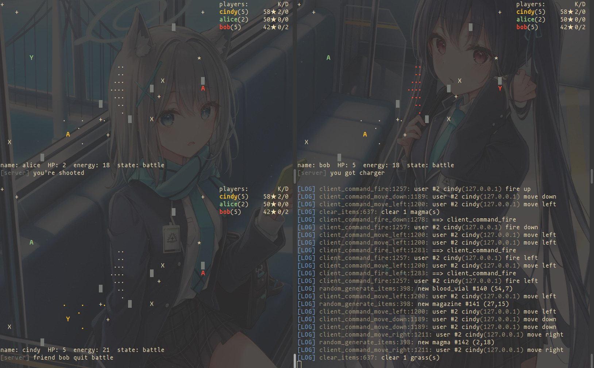

# Terminal-Shooting-Game

Multi-player shooting game in linux terminal.

v1.0.0 is based on [wierton/socket-based-naive-game](https://github.com/wierton/socket-based-naive-game).

**English** | [Chinese](https://github.com/hydropek/terminal-stg/blob/master/README_CN.md)

## Download and Install 
  ```shell
  git clone https://github.com/hydropek/terminal-stg --depth=1
  cd terminal-stg
  make
  ```

## Run  

  1. run `./server` in one terminal
  2. run `./client [server_ip]` in another terminal, example: `./client 172.45.33.101 ` (if you don't give IP address, then it will connect to 127.0.0.1)
  3. tips:  
     You are admin when you both run `./server`and `./client` on same computer

## Instructions  

### 1. enter the game

  Use `w` `s` `a` `d` `j` `k` to switch selected button.

  You can choose free-for-all mode or private mode. You can invite other players to your current room.

### 2. commands 

  * Type `<TAB>` to enter command mode.
  * Type `help --list` for all available commands
  * Type `help command` for further information of this command
  * Commands:
    | name | meaning | example |
    |:----:|:-------:|:-------:|
    |quit|quit the game| `quit` |
    |ulist|display online players| `ulist` |
    |invite|invite a player to your current room| `invite alice` |
    |tell|tell a player something| `tell bob` |
    |yell|tell to all player| `yell` |
    |fuck|terminate all player and server| `fuck`|
    |admin|input admin command| `admin ban cindy` |
    
    Admin Command:
    | name | meaning | example|
    |:----:|:-------:|:------:|
    |ban|kill a player| `admin ban alice`|
    |energy|set player energy|`admin energy bob 100`|
    |hp| set player hp | `admin hp cindy 100`|
    |pos| set player position | `admin pos bob 1 1`|
    |setadmin|change player authority (1: admin, 0: not admin)| `admin setadmin cindy 1`|
###  3. quit

  press `Ctrl-C` or input `quit` in command mode to quit.

###  4. character in battle

  |  character  |  meaning  |
  |:-----------:|:---------:|
  |      Y      |    you    |
  |      A      |   others  |
  |      █      |   grass   |
  |      X      |   magma   |
  |      +      |  magazine |
  |      *      | blood vial|
  |      o      | landmine  |
  |      .      |  bullet   |

  note:
  - the bullet will have the same color with you when it belongs to you, otherwise it will be white.
  - you can't see other player's landmine.

###  5. operations in battle

  * use `w` `s` `a` `d` for moving around
  * fire (8 directions, and h-j-k-l is same to vim):  
    ```
    y k o
    h   l
    n j .  
    ```
  * use `K` `J` `H` `L` for fire multiple bullets.
  * use `z` for putting landmine
  * use `(space)` for close attack

###  6. quit the battle

  note that even you die, you will not be quited from the battle
but your role will be changed from player into witness. If you
want to return the last ui, you need to type `q`.

## Recently Update
  see **[update.md](https://github.com/hydropek/terminal-stg/blob/master/update.md)**

## Screenshot:
  
