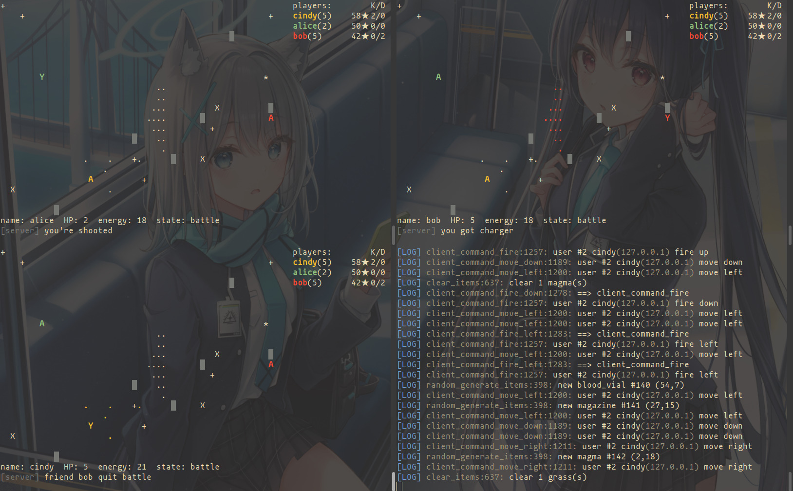

# Terminal-Shooting-Game

Linux 终端下的多人射击游戏。

v1.0.0 版本基于 [wierton/socket-based-naive-game](https://github.com/wierton/socket-based-naive-game).

[English](https://github.com/hydropek/terminal-stg/blob/master/README.md) | **Chinese**

## 下载
  ```shell
  git clone https://github.com/hydropek/terminal-stg --depth=1
  cd terminal-stg
  make
  ```

## 运行 

  1. 在一个终端运行 `./server`
  2. 在另一个终端运行 `./client [server_ip]` , 比如: `./client 172.45.33.101 ` 。如果不给出 IP 地址，则连接 127.0.0.1（本机ip）
  3. 如果在同一台电脑上同时运行 `./server` 和 `./client` ，那么此 client 具有管理员权限。

## 说明

### 1. 进入游戏

  使用 `w` `s` `a` `d` `j` `k` 来选择按钮

  你可以选择 free-for-all 模式或者创建一个私人房间。

  你可以邀请他人进入你所在的房间。

### 2. 符号

  |     符号    |   意义    |
  |:-----------:|:---------:|
  |      Y      |   你自己  |
  |      A      |   其他人  |
  |      █      |    草丛   |
  |      X      |    沼泽   |
  |      +      |    弹药包 |
  |      *      |    血包   |
  |      o      |    地雷   |
  |      .      |    子弹   |

  注意：
  - 在你的视角下，你的子弹与你同色，其他人的子弹为白色。
  - 你只能看见自己埋下的地雷。

### 3. 操作

  * 移动：`w` `s` `a` `d` 
  * 开火 (8个方向, 其中 h-j-k-l 为 Vim 风格):  
    ```
    y k o
    h   l
    n j .  
    ```
  * 使用 `K` `J` `H` `L` 一次射出多枚子弹。
  * 使用 `z` 埋地雷。
  * 使用 `(space)` 近战。

### 4.退出房间

  注意：即使你死了，你也不会退出房间，而是进入观战视角，如果你想返回上一个界面，键入 `q`。

### 5.命令 

  * 敲下 `<TAB>` 或者 `:` 来输入命令
  * 输入 `help --list` 获取所有的可用命令
  * 输入 `help command` 获取命令的更多信息
  * 命令列表:
    | 命令 | 作用 | 示例 |
    |:----:|:-------:|:-------:|
    |quit|退出程序| `quit` |
    |ulist|查看在线用户列表| `ulist` |
    |invite|邀请用户进入你所在的房间| `invite alice` |
    |tell|与一个用户私聊| `tell bob` |
    |yell|广播信息| `yell` |
    |fuck|强制结束所有的客户端与服务器| `fuck`|
    |admin|输入管理员命令| `admin ban cindy` |
    
    管理员命令:
    | 命令 | 作用 | 示例|
    |:----:|:-------:|:------:|
    |ban|踢掉某玩家| `admin ban alice`|
    |energy|设置某玩家的能量值|`admin energy bob 100`|
    |hp| 设置某玩家的 HP | `admin hp cindy 100`|
    |pos| 设置某玩家的位置 | `admin pos bob 1 1`|
    |setadmin|设置某客户端的权限 (1: 管理员, 0: 非管理员)| `admin setadmin cindy 1`|

### 6.退出程序

  按下 `Ctrl-C` 或者输入命令 `quit` .

## 更新内容
  见 [update.md](https://github.com/hydropek/terminal-stg/blob/master/update.md)

## 运行截图
  
